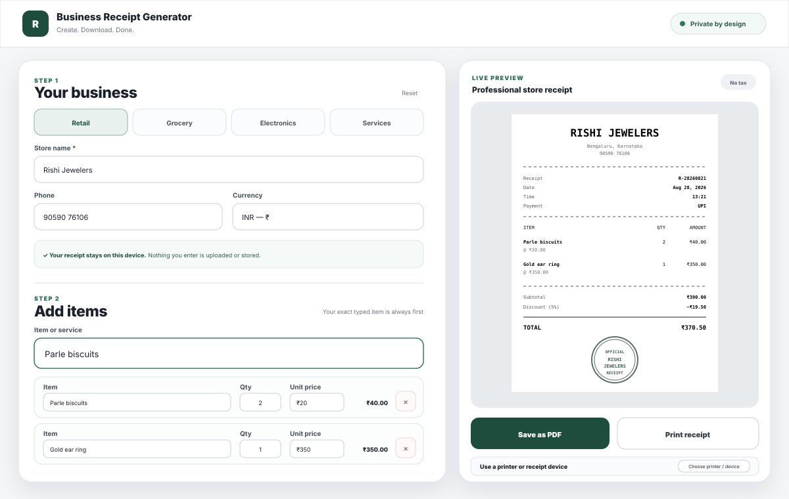
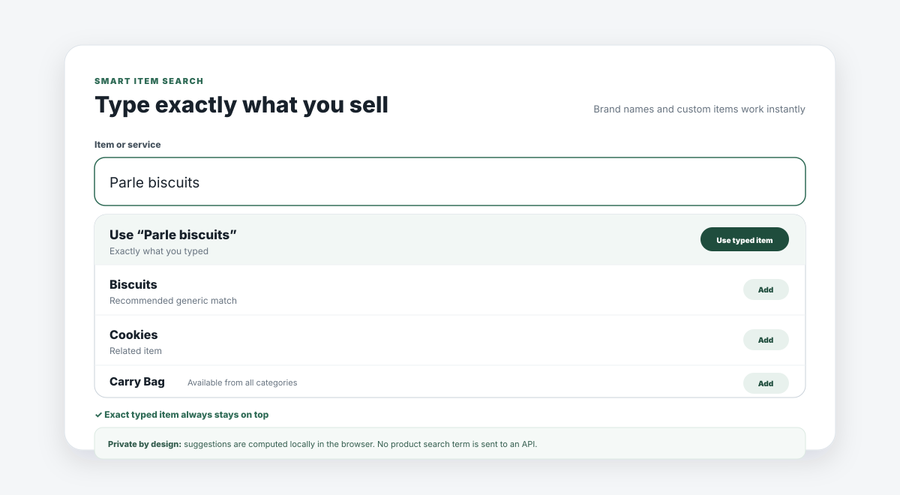
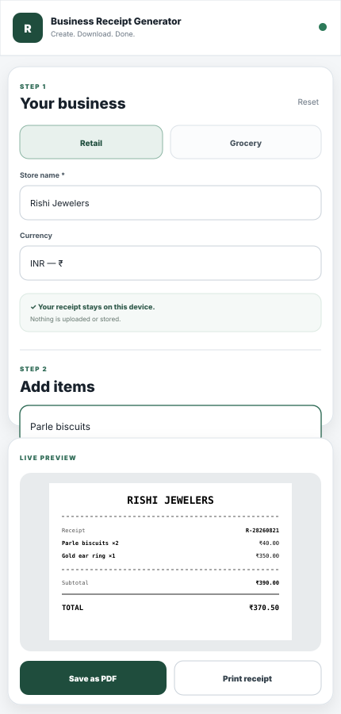
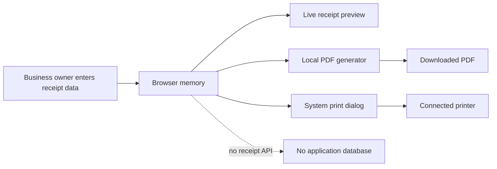

<div align="center">

# 🧾 Business Receipt Generator

### A fast, privacy-first receipt maker for small businesses

Create professional store-style receipts, use exact product or brand names, apply discounts, generate a business stamp, download a real PDF instantly, or print to a connected receipt device — **without creating an account or storing customer data**.

[](https://business-receipt-generator.vercel.app)
[](https://github.com/Rishikeshsanin/business-receipt-generator/tree/release/v2)
[](#-privacy-by-design)


</div>

---

## ✨ Product preview

<p align="center">
  
</p>

The app is intentionally simple: **open it → create a receipt → download or print it → leave**.

> **Live:** https://business-receipt-generator.vercel.app

---

## 🎯 Why this project exists

Many receipt tools either require an account, store business/customer information, force users through large forms, or make product entry unnecessarily slow.

Business Receipt Generator focuses on the opposite experience:

- no signup
- no backend account
- no receipt database
- no analytics requirement
- no saved customer history
- no product API dependency
- no tax calculation in the current release
- no setup before creating a receipt

Everything important happens directly in the browser.

---

## 🚀 Release 2 highlights

### 🔎 Smart item search

Users can type **anything they actually sell** — generic items, services, brand names, or completely custom text.

<p align="center">
  
</p>

Example:

```text
Parle biscuits
```

The exact text is always placed first as:

```text
Use “Parle biscuits”
```

Relevant catalog matches stay below it. This gives businesses the convenience of suggestions without forcing them into a fixed catalog.

The matching engine is local and typo-tolerant, using normalized text and edit-distance-style fuzzy matching.

### 🧮 Receipt calculation

Each line item contains only the essentials:

- item / service name
- whole-number quantity
- unit price

The app automatically calculates line totals, subtotal, optional overall discount, and final grand total.

Discounts support:

- percentage
- fixed amount

**Taxes are intentionally not included in Release 2.**

### 🏪 Automatic business stamp

The store name is transformed into a professional circular receipt stamp shown in the live preview and PDF output.

### 📄 Direct PDF download

**Save as PDF** creates the receipt locally and triggers a `.pdf` download immediately.

No server-side PDF service is used and receipt contents are not uploaded for generation.

### 🖨️ Printer / receipt-device support

Businesses can also use:

- **Print receipt**
- **Choose printer / device**

These open the operating system/browser print interface so a user can select an already-connected normal printer or receipt printer.

### 📱 Responsive interface

<p align="center">
  
</p>

The editor and receipt preview adapt from desktop to tablet and mobile layouts.

---

## ✅ Features

| Area | Capability |
|---|---|
| Business setup | Category, store name, phone, address, currency |
| Item entry | Live suggestions on every character |
| Search | Typo-tolerant fuzzy matching |
| Custom products | Exact typed item always available first |
| Brand names | Works without needing the brand in the built-in catalog |
| Quantity | Positive whole numbers only |
| Pricing | Unit price + automatic line total |
| Discount | Percentage or fixed amount |
| Tax | Disabled / not calculated in Release 2 |
| Receipt details | Date, time, payment method, receipt number |
| Preview | Professional thermal/store-style receipt |
| Branding | Automatic store stamp from business name |
| PDF | Direct local `.pdf` generation + download |
| Printing | Native printer / receipt-device selection |
| Currency | INR default + common international currencies |
| Keyboard UX | Arrow-key / Enter support in suggestions |
| Responsiveness | Desktop, tablet and mobile layouts |
| Storage | No user receipt data retained |

---

## 🔐 Privacy by design

Privacy is an architectural rule in this project, not a checkbox added later.



### The application does **not** use

- a receipt database
- authentication
- customer accounts
- localStorage for receipt persistence
- sessionStorage for receipt persistence
- analytics for receipt contents
- cookies for receipt storage
- server-side PDF processing
- a remote product-search API

The production Content Security Policy also prevents application JavaScript from making arbitrary outbound connections (`connect-src 'none'`).

Refreshing or leaving the page removes the in-memory receipt state.

---

## 🧠 Why no product API?

A global product API sounds attractive for examples such as **Parle-G**, **Amul**, **Britannia**, or **Samsung**, but it creates several trade-offs:

1. product coverage is never complete across every business category
2. brand catalogs change constantly
3. third-party services add availability and rate-limit dependencies
4. typed search terms would need to leave the browser

Instead, this project combines:

```text
local category-aware catalog
        +
typo-tolerant fuzzy suggestions
        +
exact typed item always first
```

That makes `Parle biscuits`, `Gold ear ring`, `AC repair`, or any other business-specific item immediately usable while preserving the stateless privacy model.

---

## 🏗️ Architecture

The application is deliberately lightweight.

```text
Browser
├── index.html        → application structure
├── styles.css        → base responsive UI
├── app.js            → catalog, fuzzy search, calculations, preview
├── release2.css      → Release 2 UX additions
└── release2.js       → whole quantities, direct PDF, printer flow

Hosting
└── Vercel static deployment

Persistent application data
└── None
```

There is no backend service required to run the core product.

More detail: [`docs/ARCHITECTURE.md`](docs/ARCHITECTURE.md)

---

## 🛠️ Tech used

### Frontend

- HTML5
- CSS3
- Vanilla JavaScript
- DOM APIs
- `Intl.NumberFormat`
- Blob / Object URL browser APIs
- native browser printing
- local PDF construction

### Search / UX

- normalized string matching
- Levenshtein-style edit distance
- category-aware relevance ranking
- custom-item fallback
- keyboard-accessible combobox behavior

### Deployment / source control

- Git
- GitHub
- Vercel

### Security / privacy

- strict Content Security Policy
- no arbitrary network connections from the app
- disabled camera, microphone and geolocation permissions
- no user-data database
- no receipt persistence

---

## 📁 Project structure

```text
business-receipt-generator/
├── index.html
├── styles.css
├── app.js
├── release2.css
├── release2.js
├── vercel.json
├── README.md
├── CHANGELOG.md
├── SECURITY.md
└── docs/
    ├── ARCHITECTURE.md
    ├── TESTING.md
    └── screenshots/
        ├── app-overview.svg
        ├── smart-search.svg
        └── mobile-view.svg
```

---

## ▶️ Run locally

No installation or environment variables are required.

### Option 1 — open directly

Clone the repository and open `index.html` in a browser.

```bash
git clone https://github.com/Rishikeshsanin/business-receipt-generator.git
cd business-receipt-generator
```

### Option 2 — local static server

Using Python:

```bash
python -m http.server 8080
```

Then open:

```text
http://localhost:8080
```

---

## ☁️ Deployment

The application is a static site and does not require secrets, databases, server functions, or environment variables.

Current production deployment:

**https://business-receipt-generator.vercel.app**

Vercel is connected to the repository's `main` branch, so production updates are deployed from Git commits.

The same project can also be hosted on platforms such as GitHub Pages, Netlify, or Cloudflare Pages.

---

## 🧪 Quality checks

The release is designed around these high-value checks:

- business details update the receipt preview
- category selection affects ranking, not item availability
- exact typed custom item appears first
- spelling mistakes still surface useful matches
- quantity remains whole-number only
- negative values cannot produce negative totals
- percentage discount is capped correctly
- fixed discount cannot reduce total below zero
- PDF is generated locally
- PDF download receives a generated filename
- print flow opens the native print interface
- receipt data is not persisted after refresh
- desktop/tablet/mobile layouts remain usable

See [`docs/TESTING.md`](docs/TESTING.md) for the full manual regression checklist.

---

## 📦 Release history

### Release 2 — current

Branch: [`release/v2`](https://github.com/Rishikeshsanin/business-receipt-generator/tree/release/v2)

Key upgrades:

- exact typed product always appears first
- better support for brand/custom product names
- whole-number quantities
- direct PDF download
- printer/device flow
- creator/contact footer
- improved responsive UX

### Release 1 — preserved baseline

Branch: [`release/v1`](https://github.com/Rishikeshsanin/business-receipt-generator/tree/release/v1)

The original working version is preserved independently as a rollback/reference point.

Full history: [`CHANGELOG.md`](CHANGELOG.md)

---

## 🗺️ Possible future improvements

The current release intentionally stays small and stateless. Future improvements could include optional features that preserve that rule, such as:

- more local item aliases and spelling variants
- optional receipt themes / paper widths
- QR code on the generated receipt
- configurable thank-you message
- dedicated ESC/POS printer mode where browser/device support permits it
- installable PWA/offline mode

A database, account system, or compulsory cloud sync is **not** part of the current product direction.

---

## 👤 Creator

**Rishikesh M**

- 📞 9059076106
- ✉️ rishikeshjonin@gmail.com
- 🐙 [GitHub — Rishikeshsanin](https://github.com/Rishikeshsanin)
- 🌐 [Live project](https://business-receipt-generator.vercel.app)

---

<div align="center">

### Create. Download. Done.

Built as a small-business utility with privacy, speed and simplicity as first-class requirements.

</div>
