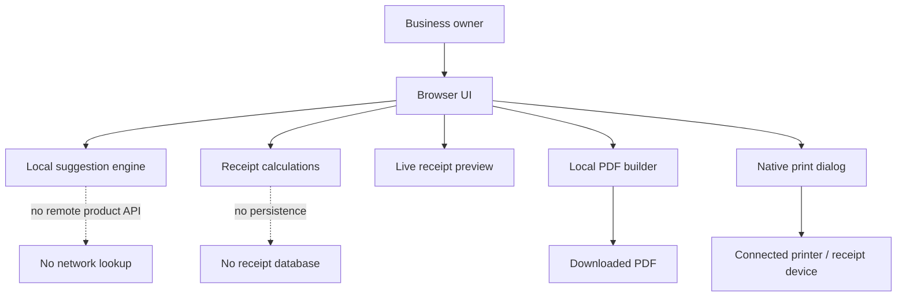

# Architecture

Business Receipt Generator is intentionally designed as a **static, browser-only application**.

The primary architectural goal is simple: a business owner should be able to create a receipt without creating an account and without sending receipt contents to an application backend.

## System overview



## Runtime model

All receipt state is held in JavaScript memory while the page is open.

Examples include:

- selected business category
- store name
- address and phone
- items
- quantities
- unit prices
- discount
- payment method
- receipt number

The application does not intentionally persist this receipt state to `localStorage`, `sessionStorage`, a cookie, or an application database.

Refreshing or leaving the page resets the in-memory working state.

## Files

### `index.html`

Defines the semantic application structure:

- business configuration
- item search
- item editor
- receipt details
- discount controls
- live receipt preview
- export/print actions
- creator footer

### `styles.css`

Contains the base design system and responsive layout.

Key concerns:

- desktop two-column editor/preview layout
- tablet single-column fallback
- mobile controls
- thermal-style receipt visual treatment
- print stylesheet

### `app.js`

Contains the core Release 1 behavior and shared application logic:

- category definitions
- local item catalog
- normalization
- Levenshtein-style fuzzy matching
- relevance scoring
- suggestion rendering
- item state
- totals
- receipt preview rendering
- discount calculation
- store stamp rendering

### `release2.css`

Adds Release 2 presentation refinements, including:

- exact-typed-item emphasis
- printer/device section
- creator footer
- responsive Release 2 adjustments

### `release2.js`

Adds Release 2 behavior without requiring a backend:

- exact typed item moved to the top of suggestions
- whole-number quantity enforcement
- direct local PDF generation
- direct `.pdf` download
- system print flow
- connected-printer/device flow

### `vercel.json`

Defines production security headers and static-host configuration.

## Item search design

The search engine combines three ideas.

### 1. Local catalog

A broad built-in catalog provides common products and services across categories such as:

- grocery
- restaurant / café
- bakery
- clothing
- electronics
- pharmacy
- hardware
- stationery
- salon / beauty
- services
- automotive
- retail

### 2. Fuzzy matching

The query and item aliases are normalized before scoring.

The matcher considers:

- exact match
- prefix match
- substring match
- keyword match
- token match
- small edit distance
- selected-category relevance

### 3. Exact typed fallback

Whatever the user typed is always available as a first-class item.

This is important for:

- brand names
- local products
- custom services
- shop-specific naming
- products absent from the built-in catalog

It also removes the need for a remote product API.

## Receipt calculations

For each item:

```text
line total = whole-number quantity × unit price
```

Then:

```text
subtotal = sum(line totals)
```

Discount can be either:

```text
percentage discount = subtotal × percentage / 100
```

or:

```text
fixed discount = fixed amount, capped at subtotal
```

Finally:

```text
grand total = max(0, subtotal - discount)
```

Taxes are intentionally not calculated in Release 2.

## PDF generation

Release 2 generates a small thermal-style PDF directly inside the browser.

The flow is:

```text
receipt state
   ↓
PDF text/vector commands
   ↓
PDF byte string
   ↓
Blob(application/pdf)
   ↓
URL.createObjectURL(...)
   ↓
<a download="...pdf">
   ↓
device download
```

No application server receives the receipt for PDF creation.

## Printing

Physical printing uses the browser/operating system's native print dialog.

This is the most interoperable approach for ordinary printers and receipt printers already installed on the user's device.

A future dedicated ESC/POS integration could be added separately where WebUSB/WebBluetooth/device support is appropriate.

## Deployment

Production is deployed as a static Vercel project connected to GitHub.

No database, serverless receipt API, secret key, or environment variable is required for the core application.

Production URL:

https://business-receipt-generator.vercel.app
